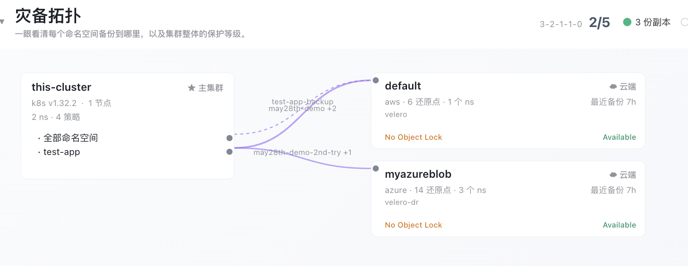
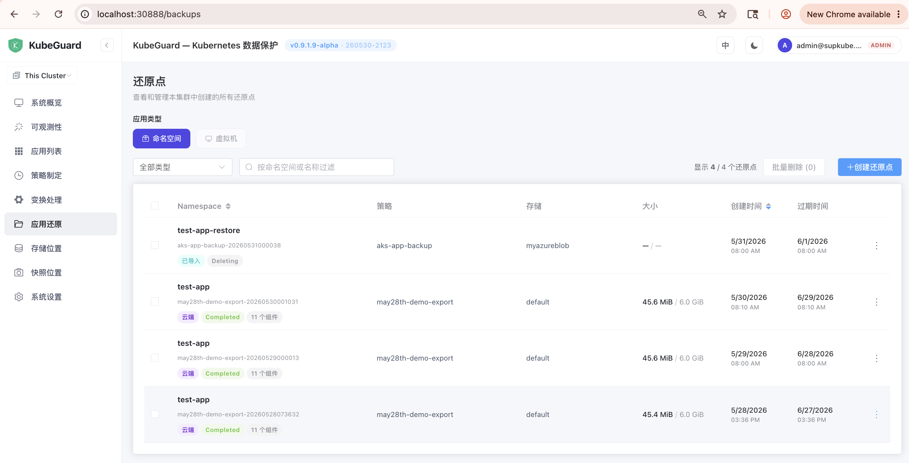
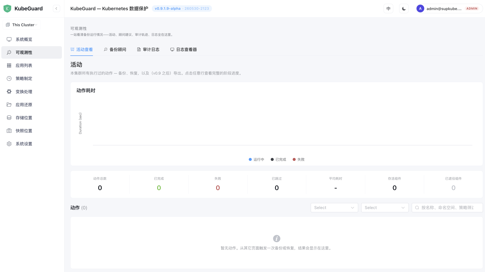
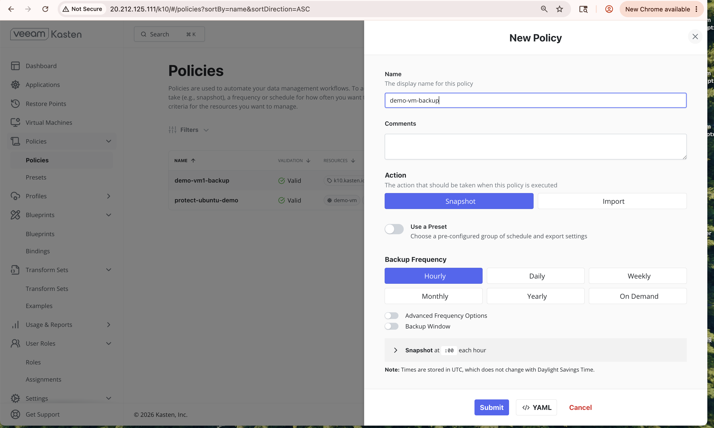
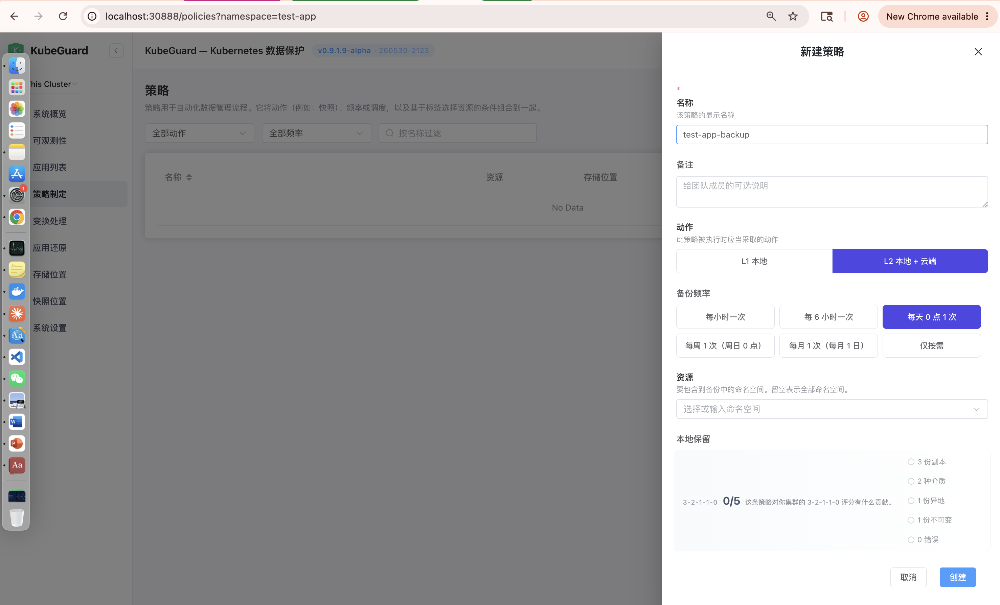
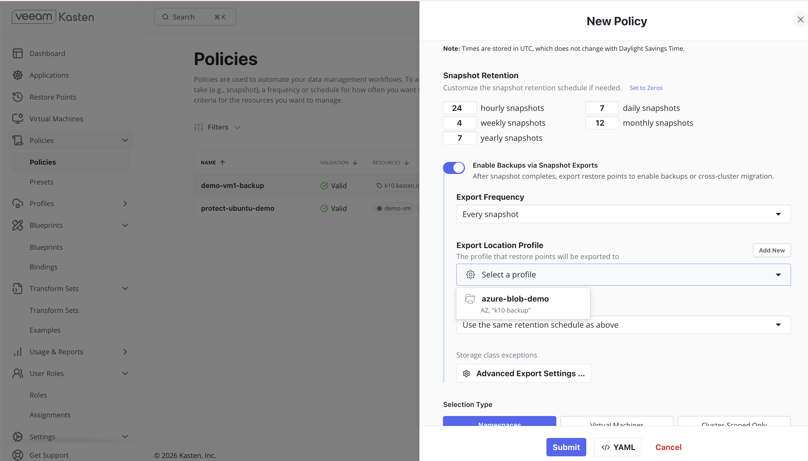

1. 灾备拓扑中
   This-Cluster 应该换成 Clsuter Name 如：docker-desktop
   Cluster 与 存储库应该是分开不同的颜色
   如果有 本地快照，Export 数据到本地存储桶，或是 云端桶，有Backup Copy 要反映出来

   kubectl get node

   NAME             STATUS   ROLES           AGE    VERSION
   docker-desktop   Ready    control-plane   212d   v1.32.2

2.

我在选择多个还原点进行删除，清除数据时，发现后台是一直在清理还原点的，但此时前台的还原点是慢慢清掉的。目前两个Cluster 都有没删除掉的还原点，你先不要替我操作。相信告诉我为什么？

同时，在前台还能操作这个还原点，我们应当如下考虑
a 清理还原点，应该记录到 Activity 中，删除还原点也是一个 Task，它应该被显示，并切也是有日志的。可以查询与管理，如果发生问题，可以进行日志的分析

b 还原点在被删除的过程中，在 Restore Point 列表中 应被锁定（不可操作状态，防止用户误操作）

关于Activity的数据

在我删除了还原点之后，Activity 里的数据全部都清掉了，Activity 中的列表乃是已经做过的 Task 的记录，有备份、还原、数据复制，Import 还原点，包括 删除 Restore Point 等等，本身即使是还原点不在了，清掉了。也应该是给给客户看到执行的历史的。请考虑一下，这个需求。

3. 我在选择一个应用Test-app 点“”创建新策略"时，跳转到了Policy 列表，但没有把 新建窗口打开，把策略名称，按应用去填写。
4. 把新建策略这里，L1本地， L2 本地云端，替换成 与Kasten 一致的 Snapshot 与 import，在下面设定与 Kasten 一样的 开关，Enable Backup via Snapshot Export，再选存储桶。

   

   

